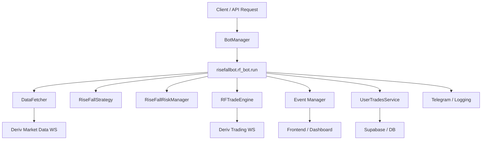
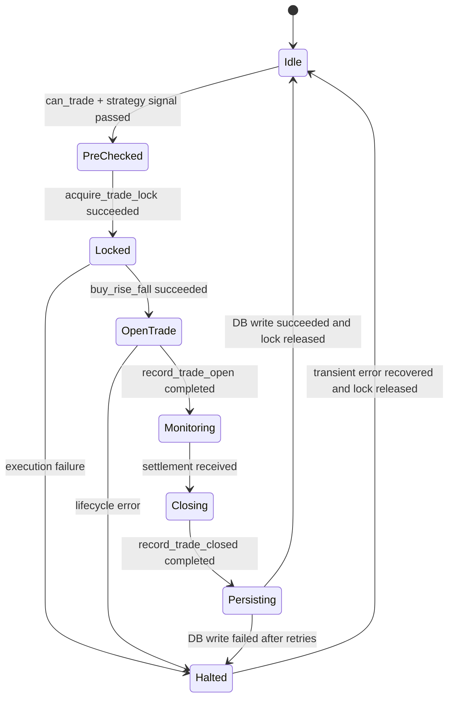
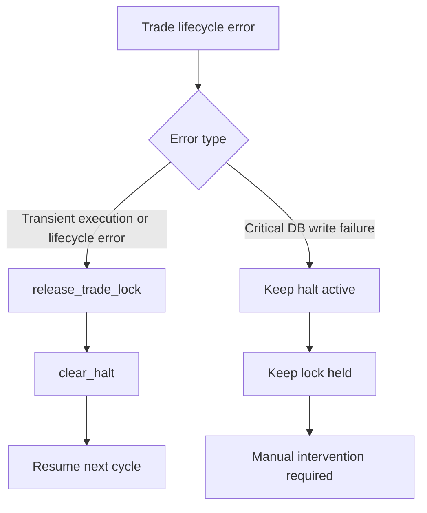

# RiseFall Architecture Diagram

This diagram-focused document reflects the current RiseFall implementation in the codebase.

It replaces the older box-drawing version and aligns with the current 6-step trade lifecycle enforced by:

- `app/bot/manager.py`
- `risefallbot/rf_bot.py`
- `risefallbot/rf_risk_manager.py`
- `risefallbot/rf_trade_engine.py`

## 1. System Context



## 2. Runtime Control Flow

```mermaid
flowchart TD
    A[BotManager.start_bot] --> B[Acquire session lock]
    B --> C[Create asyncio task]
    C --> D[rf_bot.run]
    D --> E[Build runtime objects]
    E --> F[Connect data and trade sockets]
    F --> G[Broadcast running status]
    G --> H[Enter scan loop]

    H --> I{System halted?}
    I -- Yes --> H
    I -- No --> J{Trade active or mutex held?}
    J -- Yes --> K[Skip symbol scan]
    K --> H
    J -- No --> L[Iterate configured symbols]
    L --> M[_process_symbol(symbol)]
    M --> H
```

## 3. Single-Trade Lifecycle

The key rule is simple: only one RiseFall trade lifecycle may be active at a time for a bot instance.

```mermaid
sequenceDiagram
    participant Loop as rf_bot scan loop
    participant Risk as RiseFallRiskManager
    participant Strat as RiseFallStrategy
    participant Engine as RFTradeEngine
    participant DB as UserTradesService
    participant UI as Event Manager

    Loop->>Risk: can_trade(symbol, stake)
    Risk-->>Loop: allowed / blocked
    Loop->>Strat: analyze(candles)
    Strat-->>Loop: signal or reject

    Loop->>Risk: STEP 1 acquire_trade_lock(symbol, "pending", wait_for_lock=False)
    Risk-->>Loop: mutex acquired

    Loop->>Engine: STEP 2 buy_rise_fall(...)
    Engine-->>Loop: contract_id, buy result

    Loop->>Risk: STEP 3 record_trade_open(...)
    Loop->>UI: broadcast trade_lock_active + trade_opened

    Loop->>Engine: STEP 4 wait_for_result(contract_id)
    Engine-->>Loop: settlement
    Loop->>Risk: record_trade_closed(...)

    Loop->>DB: STEP 5 write trade with retry
    DB-->>Loop: persisted

    Loop->>UI: broadcast trade_closed
    Loop->>Risk: STEP 6 release_trade_lock(...)
    Loop->>UI: broadcast trade_lock_released
```

## 4. Risk State Model



## 5. Decision Gates Inside `_process_symbol(...)`

```text
1. can_trade(symbol, stake)
   - blocks if halted
   - blocks if mutex already held
   - blocks on daily caps / cooldowns / loss limits

2. strategy.analyze(...)
   - returns a CALL/PUT setup or a structured rejection reason

3. acquire_trade_lock(...)
   - fast-fail if another symbol already owns the lifecycle
   - re-checks risk after mutex acquisition
   - rejects race-window duplicates before execution

4. buy_rise_fall(...)
   - sends the Deriv contract request
   - confirms contract_id before tracking

5. record_trade_open(...)
   - asserts mutex is held
   - rejects duplicate active trades
   - marks the trade as tracked

6. wait_for_result(...)
   - monitors until settlement / expiry / manual close

7. record_trade_closed(...)
   - updates PnL, streaks, cooldowns, and active trade state

8. write to DB
   - retries before giving up
   - lock stays held until persistence succeeds

9. release_trade_lock(...)
   - only after the lifecycle is complete
```

## 6. Important Error Paths



## 7. Practical Mental Model

Think of RiseFall as four layers:

```text
Layer 1: Orchestration
BotManager + rf_bot

Layer 2: Signal generation
rf_strategy

Layer 3: Safety and lifecycle control
rf_risk_manager

Layer 4: External I/O
DataFetcher + RFTradeEngine + DB + events + Telegram
```

And one operating rule sits above everything:

```text
No new trade may start unless:
- strategy approves the setup
- risk manager allows it
- the trade mutex is acquired
- the previous trade lifecycle has been fully closed and persisted
```
